# Progressive-Aggregator Benchmark: CLASSIC vs FUTURE_BASED

## Executive Summary

Comprehensive comparison of **CLASSIC** and **FUTURE_BASED** execution modes across cold and warm start scenarios.

**Test Configuration:**

- Source Functions: 5 parallel executions with delays [2.0s, 3.0s, 4.0s, 0.3s, 0.5s]
- Runs per scenario: 5
- Region: eu-west-1
- Date: January 16, 2026

---

## Quick Comparison

```mermaid
flowchart LR
    subgraph Results["🏆 Key Results"]
        direction TB
        A["FUTURE_BASED Cold<br/>**22.2% faster** than CLASSIC Cold"]
        B["FUTURE_BASED Warm<br/>**5.9% faster** than CLASSIC Warm"]
        C["Background polling<br/>**2-3 inputs pre-resolved**"]
    end
```



---

## Generated Charts

The following charts were generated from actual benchmark data:

| Chart                  | Description                    | File                                                                           |
| ---------------------- | ------------------------------ | ------------------------------------------------------------------------------ |
| **Dashboard**          | Complete 4-panel comparison    | [benchmark_comparison_chart.png](results/benchmark_comparison_chart.png)       |
| **E2E Latency**        | Cold & Warm latency comparison | [e2e_latency_comparison.png](results/e2e_latency_comparison.png)               |
| **Cold vs Warm**       | Impact of cold starts          | [cold_vs_warm_impact.png](results/cold_vs_warm_impact.png)                     |
| **Background Polling** | Pre-resolved inputs            | [background_polling_efficiency.png](results/background_polling_efficiency.png) |
| **Consistency**        | Standard deviation comparison  | [consistency_comparison.png](results/consistency_comparison.png)               |
| **Cost**               | Cost per run breakdown         | [cost_comparison.png](results/cost_comparison.png)                             |

---

## End-to-End Latency Comparison

| Scenario                | CLASSIC  | FUTURE_BASED | Difference          |
| ----------------------- | -------- | ------------ | ------------------- |
| **Cold Start (mean)**   | 7,913 ms | 6,160 ms     | **⬇️ 22.2% faster** |
| **Cold Start (median)** | 7,931 ms | 6,153 ms     | **⬇️ 22.4% faster** |
| **Warm (mean)**         | 4,844 ms | 4,559 ms     | **⬇️ 5.9% faster**  |
| **Warm (median)**       | 4,837 ms | 4,553 ms     | **⬇️ 5.9% faster**  |

### Latency Breakdown


---

## Detailed Metrics Tables

### Cold Start Comparison

| Metric                | CLASSIC    | FUTURE_BASED | Winner     |
| --------------------- | ---------- | ------------ | ---------- |
| E2E Latency (mean)    | 7,913 ms   | 6,160 ms     | 🏆 FUTURE  |
| E2E Latency (std)     | 58.9 ms    | 43.0 ms      | 🏆 FUTURE  |
| Cold Start Rate       | 100%       | 100%         | -          |
| Init Duration (total) | 6,373 ms   | 6,371 ms     | Tie        |
| Pre-Resolved Inputs   | 0/5        | 3/5          | 🏆 FUTURE  |
| Billed Duration       | 19,896 ms  | 21,986 ms    | 🏆 CLASSIC |
| Cost per Run          | $0.0000438 | $0.0000483   | 🏆 CLASSIC |

### Warm Start Comparison

| Metric              | CLASSIC    | FUTURE_BASED | Winner     |
| ------------------- | ---------- | ------------ | ---------- |
| E2E Latency (mean)  | 4,844 ms   | 4,559 ms     | 🏆 FUTURE  |
| E2E Latency (std)   | 65.7 ms    | 25.4 ms      | 🏆 FUTURE  |
| Cold Start Rate     | 0%         | 0%           | -          |
| Pre-Resolved Inputs | 0/5        | 2/5          | 🏆 FUTURE  |
| Billed Duration     | 11,318 ms  | 14,921 ms    | 🏆 CLASSIC |
| Cost per Run        | $0.0000255 | $0.0000332   | 🏆 CLASSIC |

---

## Cold vs Warm Impact


| Mode         | Cold (ms) | Warm (ms) | Cold→Warm Improvement |
| ------------ | --------- | --------- | --------------------- |
| CLASSIC      | 7,913     | 4,844     | **38.8% faster**      |
| FUTURE_BASED | 6,160     | 4,559     | **26.0% faster**      |

---

## Background Polling Effectiveness


| Scenario       | Pre-Resolved | Wait Required | Avg Wait Time |
| -------------- | ------------ | ------------- | ------------- |
| FUTURE Cold    | 3/5 (60%)    | 2/5 (40%)     | 1,668 ms      |
| FUTURE Warm    | 2/5 (40%)    | 3/5 (60%)     | 3,290 ms      |
| CLASSIC (both) | 0/5 (0%)     | 5/5 (100%)    | N/A           |

---

## Cost Analysis


| Scenario     | Cost per Run | vs CLASSIC Warm |
| ------------ | ------------ | --------------- |
| CLASSIC Cold | $0.0000438   | +71.8%          |
| FUTURE Cold  | $0.0000483   | +89.4%          |
| CLASSIC Warm | $0.0000255   | baseline        |
| FUTURE Warm  | $0.0000332   | +30.2%          |

**Note:** FUTURE_BASED has ~30% higher cost due to longer billed duration from background polling threads, but provides faster E2E latency.

---

## Consistency Analysis

| Scenario     | Std Dev (ms) | Coefficient of Variation |
| ------------ | ------------ | ------------------------ |
| CLASSIC Cold | 58.9         | 0.74%                    |
| FUTURE Cold  | 43.0         | 0.70%                    |
| CLASSIC Warm | 65.7         | 1.36%                    |
| FUTURE Warm  | 25.4         | **0.56%**                |

**FUTURE_BASED Warm is the most consistent** with only 0.56% variation.

---

## Architecture Comparison


---

## Recommendations

### Use FUTURE_BASED When:

- ✅ E2E latency is the primary concern
- ✅ Consistency matters (lower variance)
- ✅ Fan-in operations have many inputs
- ✅ Source functions have variable latencies

### Use CLASSIC When:

- ✅ Cost optimization is the priority
- ✅ Simple workflows with few fan-in inputs
- ✅ Debugging/tracing is important (simpler flow)

---

## Raw Data Summary

### CLASSIC Mode

```json
{
  "cold": {
    "e2e_mean_ms": 7913,
    "e2e_std_ms": 58.9,
    "cost_per_run": 0.0000438,
    "cold_start_rate": 1.0
  },
  "warm": {
    "e2e_mean_ms": 4844,
    "e2e_std_ms": 65.7,
    "cost_per_run": 0.0000255,
    "cold_start_rate": 0.0
  }
}
```

### FUTURE_BASED Mode

```json
{
  "cold": {
    "e2e_mean_ms": 6160,
    "e2e_std_ms": 43.0,
    "cost_per_run": 0.0000483,
    "pre_resolved": 3,
    "cold_start_rate": 1.0
  },
  "warm": {
    "e2e_mean_ms": 4559,
    "e2e_std_ms": 25.4,
    "cost_per_run": 0.0000332,
    "pre_resolved": 2,
    "cold_start_rate": 0.0
  }
}
```

---

## Conclusion

| Category               | Winner       | Improvement         |
| ---------------------- | ------------ | ------------------- |
| **E2E Latency (Cold)** | FUTURE_BASED | 22.2% faster        |
| **E2E Latency (Warm)** | FUTURE_BASED | 5.9% faster         |
| **Consistency**        | FUTURE_BASED | 61% lower std dev   |
| **Cost**               | CLASSIC      | 23% cheaper (warm)  |
| **Background Polling** | FUTURE_BASED | 40-60% pre-resolved |

**Overall:** FUTURE_BASED provides better performance and consistency at a modest cost increase (~30%).

---

_Generated: January 16, 2026_
_Benchmark Suite: progressive-aggregator_
_Region: eu-west-1_
