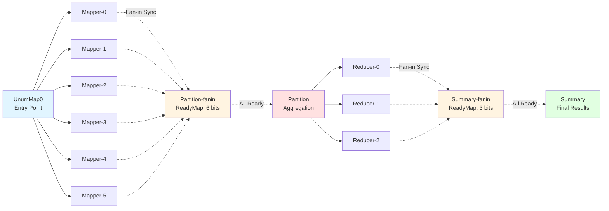

# WordCount MapReduce Workflow

A complete MapReduce implementation using the Unum serverless orchestration framework on AWS Lambda.

## Workflow Architecture

This application implements a classic MapReduce pattern with the following stages:



### Functions

1. **UnumMap0** - Entry point that spawns multiple Mapper instances
2. **Mapper** - Processes text input and counts word frequencies (6 parallel instances)
3. **Partition** - Aggregates mapper outputs and distributes to reducers (fan-in coordination)
4. **Reducer** - Combines word counts from partition (3 parallel instances)
5. **Summary** - Final aggregation producing complete word count results (fan-in coordination)

## Prerequisites

- AWS CLI configured with credentials
- Python 3.13
- AWS SAM CLI (for deployment)
- Unum framework installed
- DynamoDB table: `unum-dynamo-test-table`
- S3 bucket: `mapreduce-wordcount-fixedreducer-528757807812`

## Building and Deploying

### Step 1: Build the Application

From the wordcount directory:

```bash
python C:\Users\NimrodFoldvari\Downloads\DagL\unum_project\unum\unum-cli\unum-cli.py build -t -w unum-step-functions.json -p aws
```

This will:

- Compile the Step Functions state machine to Unum IR
- Generate AWS SAM template.yaml
- Build all Lambda functions
- Copy Unum runtime to each function
- Create build artifacts in `.aws-sam/build/`

### Step 2: Deploy to AWS

```bash
python C:\Users\NimrodFoldvari\Downloads\DagL\unum_project\unum\unum-cli\unum-cli.py deploy -b
```

Or combine build and deploy:

```bash
cd C:\Users\NimrodFoldvari\Downloads\DagL\unum_project\unum-appstore\wordcount
python C:\Users\NimrodFoldvari\Downloads\DagL\unum_project\unum\unum-cli\unum-cli.py deploy -b
```

This deploys the CloudFormation stack: `unum-mapreduce-wordcount-dynamo-new`

### Step 3: Create function-arn.yaml

After deployment, create `function-arn.yaml` with the Lambda function ARNs:

```yaml
UnumMap0: arn:aws:lambda:eu-west-1:528757807812:function:unum-mapreduce-wordcount-dynamo-n-UnumMap0Function-QnqV5dDpHP7z
Mapper: arn:aws:lambda:eu-west-1:528757807812:function:unum-mapreduce-wordcount-dynamo-new-MapperFunction-DPRPCfGeTdSC
Partition: arn:aws:lambda:eu-west-1:528757807812:function:unum-mapreduce-wordcount-dynamo--PartitionFunction-A9Q04VZ4o5r7
Reducer: arn:aws:lambda:eu-west-1:528757807812:function:unum-mapreduce-wordcount-dynamo-ne-ReducerFunction-zvNWr6BslVOQ
Summary: arn:aws:lambda:eu-west-1:528757807812:function:unum-mapreduce-wordcount-dynamo-ne-SummaryFunction-JKwz97N554Cg
```

Copy to common directory:

```bash
Copy-Item function-arn.yaml common/
```

Then rebuild and redeploy to include the file.

## Testing the Workflow

### Invoke the Workflow

Create a test payload file (e.g., `test-payload.json`):

```json
{
  "Data": {
    "Source": "http",
    "Value": {
      "text": "hello world hello test world hello",
      "destination": "mapreduce-wordcount-fixedreducer-528757807812"
    }
  }
}
```

For testing with 6 parallel mappers, use the provided `events/test.json`.

Invoke the UnumMap0 function:

```bash
aws lambda invoke \
  --function-name unum-mapreduce-wordcount-dynamo-n-UnumMap0Function-QnqV5dDpHP7z \
  --payload file://test-payload.json \
  --cli-binary-format raw-in-base64-out \
  --region eu-west-1 \
  response.json
```

### Verify Execution

#### 1. Check DynamoDB for Session Outputs

The workflow creates checkpoints in DynamoDB table `unum-dynamo-test-table`. Each execution has a unique session ID.

List all outputs for a session:

```powershell
$result = aws dynamodb scan --table-name unum-dynamo-test-table --region eu-west-1 --output text
$result | Where-Object { $_ -match "YOUR_SESSION_ID" } | Sort-Object
```

A successful execution will show:

- `UnumMap-output`
- `Mapper-unumIndex-0-output` through `Mapper-unumIndex-5-output` (6 mappers)
- `Partition-fanin` (fan-in coordination point)
- `Partition-output`
- `Reducer-unumIndex-0-output` through `Reducer-unumIndex-2-output` (3 reducers)
- `Summary-fanin` (fan-in coordination point)
- `Summary-output` (final word counts)

#### 2. Verify Fan-in Coordination (ReadyMap)

Check that all mapper branches marked themselves as ready:

```powershell
$allData = aws dynamodb scan --table-name unum-dynamo-test-table --region eu-west-1 --output json | ConvertFrom-Json
$item = $allData.Items | Where-Object { $_.Name.S -eq "YOUR_SESSION_ID/Partition-fanin" }
$item.ReadyMap.L | ForEach-Object { $_.BOOL }
```

Should show 6 `True` values (one for each mapper).

#### 3. Get Final Word Count Results

```powershell
$allData = aws dynamodb scan --table-name unum-dynamo-test-table --region eu-west-1 --output json | ConvertFrom-Json
$item = $allData.Items | Where-Object { $_.Name.S -eq "YOUR_SESSION_ID/Summary-output" }
$item.User.S
```

Example output:

```json
{"hello": 3, "world": 2, "test": 1, ...}
```

#### 4. Check CloudWatch Logs

View mapper execution and fan-in coordination:

```bash
aws logs tail /aws/lambda/unum-mapreduce-wordcount-dynamo-new-MapperFunction-DPRPCfGeTdSC \
  --since 5m --format short --region eu-west-1
```

Look for debug messages showing:

- `aggregation_function_instance_name: Partition` (all mappers use same sync point)
- `all_ready=True` for the last mapper
- `is invoking Partition` showing which mapper triggered the aggregation

## Function Invocation Flow

For a typical execution with 6 text inputs:

1. **UnumMap0** (invoked by user)

   - Spawns 6 Mapper instances in parallel

2. **Mapper × 6** (invoked by UnumMap0)

   - Each processes 1/6th of the input
   - Counts word frequencies
   - Writes checkpoint to DynamoDB
   - Participates in fan-in synchronization
   - **Last mapper to finish invokes Partition**

3. **Partition** (invoked automatically by last Mapper)

   - Reads all 6 mapper outputs
   - Partitions words across 3 reducers
   - Spawns 3 Reducer instances in parallel

4. **Reducer × 3** (invoked by Partition)

   - Each aggregates counts for its partition
   - Writes checkpoint to DynamoDB
   - Participates in fan-in synchronization
   - **Last reducer to finish invokes Summary**

5. **Summary** (invoked automatically by last Reducer)
   - Combines all reducer outputs
   - Produces final word count dictionary
   - Writes result to DynamoDB

**Total Functions Invoked: 11** (1 UnumMap0 + 6 Mappers + 1 Partition + 3 Reducers + 1 Summary)

## Bug Fix: Fan-in Coordination Issue

### The Problem

Originally, fan-in coordination was broken. When multiple branches (e.g., 6 mappers) needed to synchronize before invoking an aggregation function (e.g., Partition), only the last branch was being marked as ready in the DynamoDB ReadyMap. The ReadyMap would show:

```
[false, false, false, false, false, true]  # Only index 5 = true
```

This caused the aggregation function to never be invoked automatically.

### Root Causes

Two issues were identified:

**Issue #1: Each branch used a different sync point name**

The original code computed the aggregation function instance name including the current branch's Fan-out index:

```python
# WRONG: Each branch computed a different name
payload = {}
for f in next_payload_metadata:
    if next_payload_metadata[f] != None:
        payload[f] = next_payload_metadata[f]  # Includes Fan-out with branch index

aggregation_function_instance_name = Unum.compute_instance_name(self.function_name, payload)
# Result: "Partition-unumIndex-0", "Partition-unumIndex-1", etc. (6 different names!)
```

This created 6 separate fan-in sync points in DynamoDB, each with only 1 entry marked as true.

**Issue #2: Conditional prevented invocation when all ready**

The code required BOTH conditions to be true:

```python
if all_ready and should_invoke:
    self.invoker.invoke(self.function_name, payload)
```

The conditional (`$0 == $size - 1`) determined which branch SHOULD invoke, but if that branch finished before others were ready (`all_ready=False`), it wouldn't invoke. Meanwhile, the actual last-to-finish branch would see `all_ready=True` but have `should_invoke=False`, so it also wouldn't invoke.

### The Solution

**Fix #1: Skip Fan-out when computing aggregation function name**

```python
# FIXED: All branches use the same sync point
payload = {}
for f in next_payload_metadata:
    if next_payload_metadata[f] != None:
        # Skip Fan-out - all branches should sync on same name
        if f == "Fan-out":
            continue
        else:
            payload[f] = next_payload_metadata[f]

aggregation_function_instance_name = Unum.compute_instance_name(self.function_name, payload)
# Result: "Partition" (same for all branches!)
```

**Fix #2: Last-to-finish always invokes, ignoring conditional**

```python
# FIXED: Whoever sees all_ready=True MUST invoke
if all_ready:
    # Last to finish - must invoke regardless of conditional
    payload['Data'] = {'Source': self.datastore.my_type, 'Value': branch_instance_names}
    payload['Session'] = session
    self.invoker.invoke(self.function_name, payload)
```

The conditional is now just an optimization hint to reduce contention, but correctness is ensured by having the actual last-to-finish branch always invoke.

### Result

After the fix:

- All 6 mappers write to the SAME sync point: `41a7e109.../Partition-fanin`
- ReadyMap shows: `[true, true, true, true, true, true]` ✓
- The last mapper to finish (any of 0-5) automatically invokes Partition
- The workflow completes end-to-end without manual intervention
- Summary produces complete word counts

## Files Modified

The fix was applied to:

- `unum/runtime/unum.py` - Core Unum runtime (lines 1138-1185)
- `unum-appstore/wordcount/common/unum.py` - Local copy for builds

Both files had the same changes to the `_run_fan_in()` method.

## Troubleshooting

### Functions not being invoked automatically

Check CloudWatch logs for fan-in debug messages. You should see:

- `aggregation_function_instance_name: Partition` (without index)
- All branches showing participation in sync
- One branch showing `all_ready=True` and invoking

### ReadyMap shows all False

The functions might not have the updated code. Force update Lambda code:

```bash
cd .aws-sam/build/MapperFunction
Compress-Archive -Path * -DestinationPath ..\Mapper.zip -Force
aws lambda update-function-code --function-name <MAPPER_FUNCTION_NAME> --zip-file fileb://../Mapper.zip --region eu-west-1
```

### Missing function-arn.yaml error

Ensure `function-arn.yaml` is in the `common/` directory and rebuild/redeploy.
